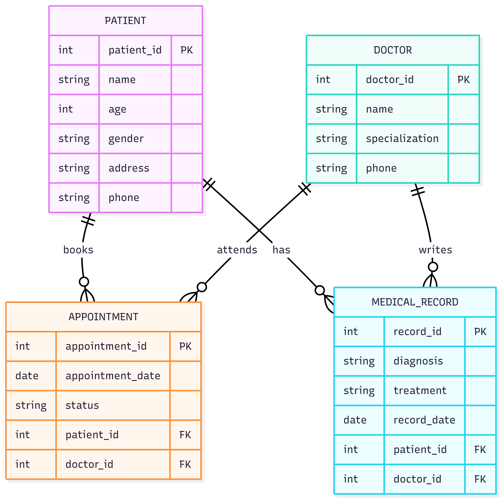

# 🏥 Hospital Management System (HMS)

[](LICENSE)


The **Hospital Management System (HMS)** is a **full-stack web application** designed to simplify and digitize hospital workflows.  
It enables hospital administrators, doctors, and staff to efficiently manage patients, doctors, appointments, and medical records through a single unified platform.

---

## 🚀 Features

- 👨‍⚕️ **Doctor Management** – Add, update and manage doctor records.  
- 🧑‍🤝‍🧑 **Patient Management** – Register new patients, maintain medical records.  
- 📅 **Appointments** – Book, edit, and cancel patient-doctor appointments.  
- 📝 **Medical Records** – Keep track of patient checkups, prescriptions, and reports.  
- 🔐 **Authentication & Authorization** – Admin, doctor, and staff roles.  
- 📊 **Dashboard** – Summarized reports for quick hospital insights.  
- 🌐 **Full-Stack Architecture** – Seamless integration between frontend and backend services.  

---

## 🛠️ Tech Stack

### Frontend
- **React.js / HTML / CSS / Bootstrap**
- Interactive dashboard components

### Backend
- **Node.js / Express.js**
- REST APIs for patients, doctors, and appointments

### Database
- **MongoDB** or **MySQL** (depending on implementation)

### Other Tools
- **JWT Authentication**
- **dotenv** for environment variables

---

## 📂 Project Structure

```
full-stack-hms/
│
├── backend/                # Server-side code (API + DB logic)
│   ├── routes/             # API endpoints
│   ├── models/             # Database schemas (patients/doctors)
│   ├── controllers/        # Business logic
│   ├── middleware/         # Auth, error handling
│   └── app.js              # Express server setup
│
├── frontend/               # Client-side code
│   ├── public/
│   └── src/
│       ├── components/     # Reusable UI components
│       ├── pages/          # Views (Doctors, Patients, Appointments)
│       └── App.js          # Main entry point
│
├── dashboard/              # (Optional Admin Dashboard)
├── docs/                   # Documentation, ER diagrams, screenshots
├── .gitignore              # Ignore node_modules, .env, build files
├── LICENSE                 # MIT License
├── README.md               # Documentation
└── .env.example            # Example environment variables
```

---

## ⚙️ Installation & Setup

### 1️⃣ Clone the Repository
```bash
git clone https://github.com/DhruvKhassa/full-stack-hms.git
cd full-stack-hms
```

### 2️⃣ Setup Backend
```bash
cd backend
npm install
```
Create `.env` file based on `.env.example`  
```env
PORT=5000
MONGO_URI=your_mongodb_connection_string
JWT_SECRET=supersecretkey
```
Run backend:
```bash
npm start
```

### 3️⃣ Setup Frontend
```bash
cd ../frontend
npm install
npm start
```
Frontend runs on 👉 `http://localhost:3000`  
Backend runs on 👉 `http://localhost:5000`

---

## 📸 Screenshots


| Dashboard | Manage Patients | Appointments |
|-----------|-----------------|--------------|
|  |  |  |

---

## 📊 ER Diagram 



---

## 📜 License
This project is licensed under the [MIT License](LICENSE).

---

## 👨‍💻 Author
- **Dhruv Khassa**  
  [GitHub](https://github.com/DhruvKhassa) · [LinkedIn](https://www.linkedin.com)

---

✨ A digital solution to make hospital workflows smarter and faster
